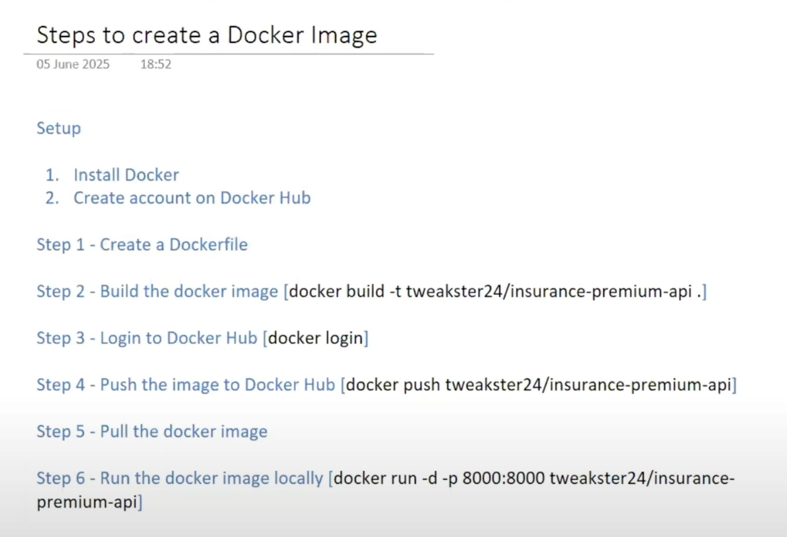

# Insurance Premium Predictor API 🚀

A simple, lightweight FastAPI project that predicts insurance premium costs based on user details like age, gender, BMI, etc. Built for quick deployment and API integration.

##  Tech Stack 🔧

- **FastAPI** – Modern, fast (high-performance), web framework
- **Uvicorn** – Lightning-fast ASGI server
- **Pydantic** – Data validation and settings management
- **Scikit-learn** – Machine learning model
- **Docker** - Docker desktop (Images, Containers)

## Installation 📦 

Clone the repository and install the dependencies:

```bash
git clone https://github.com/chaitu092/Insurance-premium-fastapi.git
cd Insurance-premium-fastapi
python -m venv venv
source venv/bin/activate  # Windows: venv\Scripts\activate
pip install -r requirements.txt
```
## Docker Support 🐳


## Project Structure 📂

.
├── app.py                 # Main FastAPI application
├── config/                # Configuration files
├── model/                 # Trained machine learning model
├── schema/                # Pydantic schemas for data validation
├── requirements.txt       # Python dependencies
└── README.md              # Project documentation

##  Running the Application ▶️

uvicorn app:app --reload

The API will be accessible at: http://127.0.0.1:8000

Interactive API documentation is available at: http://127.0.0.1:8000/docs